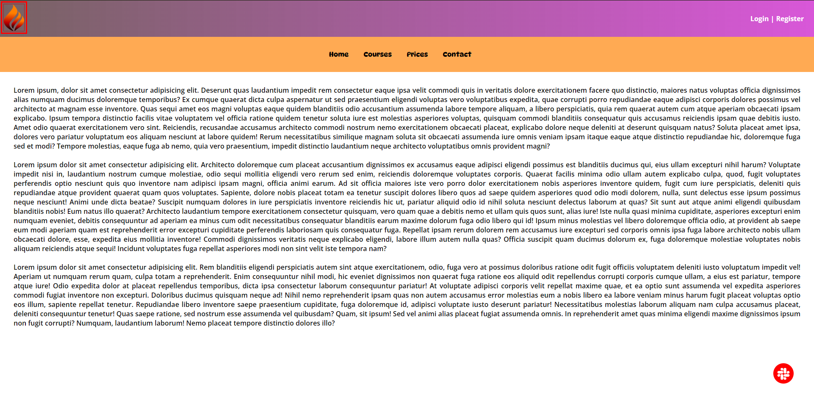

# Practise Site

The purpose of this coding challenge is to code by applying what I've learned.

## Learning Outcomes

At the end of the this coding challenge, students will be able to;

- In this project, I used float for learning purposes.

- analyze a problem, identify and apply programming knowledge for appropriate solution.

- demonstrate their knowledge of algorithmic design principles by using function effectively.

## View of the challenge site

